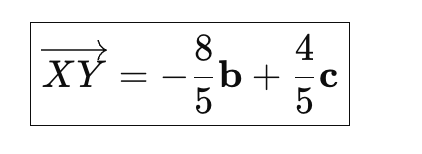
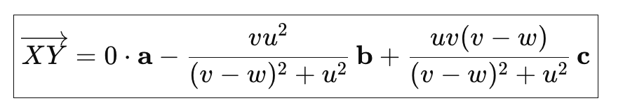
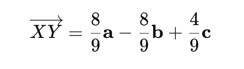
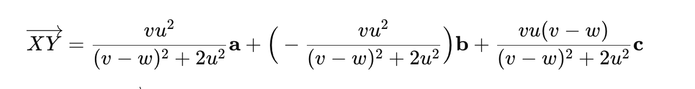

# Допълнително към задачата - отговори за произовлни и конкретни u,v,w
#### 2. Отговор на подточка a.
Отговори за u=2, v=2, w=1
- dist(AB, LM) = 4sqrt(5)/5
- cos(AB, LM) = 0
- При означения ортонормирана база S, a, b, c, такава че: SA = 2a, SK = 2b, ST=2c, X от AB, Y от LM се получава:

точката X трябва да е съвпаднала с S, и перпендикуляра представлява височината SY в триъгълник SML.

Отговори за произволни u, v, w:
- dist(AB, LM) = (u*v)/(sqrt((v-w)^2 + u^2))
- cos(g, LM): 0
- При означения ортонормирана база S, a, b, c, такава че: SA = va, SK = vb, ST=uc, X от ъглополовящата, Y от LM се получава, че:

#### 3. Отговор на подточка б.
Отговори за u=2, v=2, w=1
- dist(g, LM) = 4/3
- cos(g, LM) = 1/sqrt(10)
- При означения ортонормирана база S, a, b, c, такава че: SA = 2a, SK = 2b, ST=2c, X от ъглополовящата, Y от LM се получава, че:

Отговори за произволни u, v, w:
- dist(g, LM) = (u*v)/sqrt(2u^2 + (v-w)^2) 
- cos(g, LM): (v-w)/sqrt(2(v-w)^2 + u^2)
- При означения ортонормирана база S, a, b, c, такава че: SA = va, SK = vb, ST=uc, X от ъглополовящата, Y от LM се получава, че:
